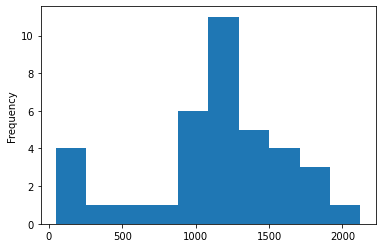
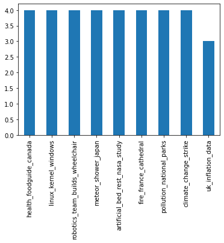

# Document Clustering of News Articles

After setting up a new GitHub repository and creating a virtual environment, I first install all required modules into the environment.


```python
!pip install pandas numpy scikit-learn matplotlib sentence-transformers
```

    Requirement already satisfied: pandas in c:\users\jdo\appdata\local\continuum\anaconda3\envs\usecase\lib\site-packages (1.4.0)
    Requirement already satisfied: numpy in c:\users\jdo\appdata\local\continuum\anaconda3\envs\usecase\lib\site-packages (1.22.1)
    Requirement already satisfied: scikit-learn in c:\users\jdo\appdata\local\continuum\anaconda3\envs\usecase\lib\site-packages (1.0.2)
    Requirement already satisfied: matplotlib in c:\users\jdo\appdata\local\continuum\anaconda3\envs\usecase\lib\site-packages (3.5.1)
    Collecting sentence-transformers
      Using cached sentence_transformers-2.1.0-py3-none-any.whl
    Requirement already satisfied: pytz>=2020.1 in c:\users\jdo\appdata\local\continuum\anaconda3\envs\usecase\lib\site-packages (from pandas) (2021.3)
    Requirement already satisfied: python-dateutil>=2.8.1 in c:\users\jdo\appdata\local\continuum\anaconda3\envs\usecase\lib\site-packages (from pandas) (2.8.2)
    Requirement already satisfied: joblib>=0.11 in c:\users\jdo\appdata\local\continuum\anaconda3\envs\usecase\lib\site-packages (from scikit-learn) (1.1.0)
    Requirement already satisfied: threadpoolctl>=2.0.0 in c:\users\jdo\appdata\local\continuum\anaconda3\envs\usecase\lib\site-packages (from scikit-learn) (3.0.0)
    Requirement already satisfied: scipy>=1.1.0 in c:\users\jdo\appdata\local\continuum\anaconda3\envs\usecase\lib\site-packages (from scikit-learn) (1.7.3)
    Requirement already satisfied: cycler>=0.10 in c:\users\jdo\appdata\local\continuum\anaconda3\envs\usecase\lib\site-packages (from matplotlib) (0.11.0)
    Requirement already satisfied: fonttools>=4.22.0 in c:\users\jdo\appdata\local\continuum\anaconda3\envs\usecase\lib\site-packages (from matplotlib) (4.29.0)
    Requirement already satisfied: pillow>=6.2.0 in c:\users\jdo\appdata\local\continuum\anaconda3\envs\usecase\lib\site-packages (from matplotlib) (9.0.0)
    Requirement already satisfied: packaging>=20.0 in c:\users\jdo\appdata\local\continuum\anaconda3\envs\usecase\lib\site-packages (from matplotlib) (21.3)
    Requirement already satisfied: pyparsing>=2.2.1 in c:\users\jdo\appdata\local\continuum\anaconda3\envs\usecase\lib\site-packages (from matplotlib) (3.0.4)
    Requirement already satisfied: kiwisolver>=1.0.1 in c:\users\jdo\appdata\local\continuum\anaconda3\envs\usecase\lib\site-packages (from matplotlib) (1.3.2)
    Collecting torch>=1.6.0
      Downloading torch-1.10.2-cp39-cp39-win_amd64.whl (226.5 MB)
    Collecting tqdm
      Downloading tqdm-4.62.3-py2.py3-none-any.whl (76 kB)
    Collecting sentencepiece
      Using cached sentencepiece-0.1.96-cp39-cp39-win_amd64.whl (1.1 MB)
    Collecting nltk
      Downloading nltk-3.6.7-py3-none-any.whl (1.5 MB)
    Collecting huggingface-hub
      Downloading huggingface_hub-0.4.0-py3-none-any.whl (67 kB)
    Collecting tokenizers>=0.10.3
      Downloading tokenizers-0.11.4-cp39-cp39-win_amd64.whl (3.3 MB)
    Collecting torchvision
      Downloading torchvision-0.11.3-cp39-cp39-win_amd64.whl (947 kB)
    Collecting transformers<5.0.0,>=4.6.0
      Downloading transformers-4.16.0-py3-none-any.whl (3.5 MB)
    Requirement already satisfied: six>=1.5 in c:\users\jdo\appdata\local\continuum\anaconda3\envs\usecase\lib\site-packages (from python-dateutil>=2.8.1->pandas) (1.16.0)
    Collecting typing-extensions
      Downloading typing_extensions-4.0.1-py3-none-any.whl (22 kB)
    Collecting regex!=2019.12.17
      Downloading regex-2022.1.18-cp39-cp39-win_amd64.whl (273 kB)
    Collecting pyyaml>=5.1
      Downloading PyYAML-6.0-cp39-cp39-win_amd64.whl (151 kB)
    Collecting sacremoses
      Downloading sacremoses-0.0.47-py2.py3-none-any.whl (895 kB)
    Requirement already satisfied: requests in c:\users\jdo\appdata\local\continuum\anaconda3\envs\usecase\lib\site-packages (from transformers<5.0.0,>=4.6.0->sentence-transformers) (2.27.1)
    Collecting filelock
      Downloading filelock-3.4.2-py3-none-any.whl (9.9 kB)
    Requirement already satisfied: colorama in c:\users\jdo\appdata\local\continuum\anaconda3\envs\usecase\lib\site-packages (from tqdm->sentence-transformers) (0.4.4)
    Collecting click
      Downloading click-8.0.3-py3-none-any.whl (97 kB)
    Requirement already satisfied: certifi>=2017.4.17 in c:\users\jdo\appdata\local\continuum\anaconda3\envs\usecase\lib\site-packages (from requests->transformers<5.0.0,>=4.6.0->sentence-transformers) (2021.10.8)
    Requirement already satisfied: urllib3<1.27,>=1.21.1 in c:\users\jdo\appdata\local\continuum\anaconda3\envs\usecase\lib\site-packages (from requests->transformers<5.0.0,>=4.6.0->sentence-transformers) (1.26.7)
    Requirement already satisfied: charset-normalizer~=2.0.0 in c:\users\jdo\appdata\local\continuum\anaconda3\envs\usecase\lib\site-packages (from requests->transformers<5.0.0,>=4.6.0->sentence-transformers) (2.0.4)
    Requirement already satisfied: idna<4,>=2.5 in c:\users\jdo\appdata\local\continuum\anaconda3\envs\usecase\lib\site-packages (from requests->transformers<5.0.0,>=4.6.0->sentence-transformers) (3.3)
    Installing collected packages: typing-extensions, tqdm, regex, pyyaml, filelock, click, torch, tokenizers, sacremoses, huggingface-hub, transformers, torchvision, sentencepiece, nltk, sentence-transformers
    Successfully installed click-8.0.3 filelock-3.4.2 huggingface-hub-0.4.0 nltk-3.6.7 pyyaml-6.0 regex-2022.1.18 sacremoses-0.0.47 sentence-transformers-2.1.0 sentencepiece-0.1.96 tokenizers-0.11.4 torch-1.10.2 torchvision-0.11.3 tqdm-4.62.3 transformers-4.16.0 typing-extensions-4.0.1
    

# Text inspection 

Let's load the required modules


```python
import pandas as pd
import numpy as np
```

Let us load the texts and labels and get a first impression of the data.


```python
texts = pd.read_csv('./preproc_texts.csv', header=None, names=['text'])
labels = pd.read_csv('./labels.csv', header=None, names=['label'])
```


```python
df = texts.merge(labels, left_index=True, right_index=True)
df.sample(5)
```


<div>
<style scoped>
    .dataframe tbody tr th:only-of-type {
        vertical-align: middle;
    }

    .dataframe tbody tr th {
        vertical-align: top;
    }

    .dataframe thead th {
        text-align: right;
    }
</style>
<table border="1" class="dataframe">
  <thead>
    <tr style="text-align: right;">
      <th></th>
      <th>text</th>
      <th>label</th>
    </tr>
  </thead>
  <tbody>
    <tr>
      <th>3</th>
      <td>An innovative high school robotics team from M...</td>
      <td>robotics_team_builds_wheelchair</td>
    </tr>
    <tr>
      <th>10</th>
      <td>Climate change is the greatest threat that we ...</td>
      <td>climate_change_strike</td>
    </tr>
    <tr>
      <th>32</th>
      <td>Historian Camille Pascal told French broadcast...</td>
      <td>fire_france_cathedral</td>
    </tr>
    <tr>
      <th>17</th>
      <td>falls deeper into the red after UK inflation s...</td>
      <td>uk_inflation_data</td>
    </tr>
    <tr>
      <th>20</th>
      <td>World Europe France opens the question should ...</td>
      <td>fire_france_cathedral</td>
    </tr>
  </tbody>
</table>
</div>


How does the length of the texts look like? Any outliers?


```python
df.text.apply(len).plot(kind="hist")
```


    <AxesSubplot:ylabel='Frequency'>


    

    


There are some rather small news articles. Are they somehow special which is why we should treat them as "outliers" possibly removing from further analysis?


```python
df.loc[df.text.apply(len)<500].style.set_properties(subset=['text'], **{'width': '900px'})
```


<style type="text/css">
#T_3ba2e_row0_col0, #T_3ba2e_row1_col0, #T_3ba2e_row2_col0, #T_3ba2e_row3_col0, #T_3ba2e_row4_col0 {
  width: 900px;
}
</style>
<table id="T_3ba2e">
  <thead>
    <tr>
      <th class="blank level0" >&nbsp;</th>
      <th id="T_3ba2e_level0_col0" class="col_heading level0 col0" >text</th>
      <th id="T_3ba2e_level0_col1" class="col_heading level0 col1" >label</th>
    </tr>
  </thead>
  <tbody>
    <tr>
      <th id="T_3ba2e_level0_row0" class="row_heading level0 row0" >10</th>
      <td id="T_3ba2e_row0_col0" class="data row0 col0" >Climate change is the greatest threat that we all face but it is the school kids of today whose futures are most on the line They are right to feel let down by the generation before them and it inspiring to see them making their voice heard today</td>
      <td id="T_3ba2e_row0_col1" class="data row0 col1" >climate_change_strike</td>
    </tr>
    <tr>
      <th id="T_3ba2e_level0_row1" class="row_heading level0 row1" >12</th>
      <td id="T_3ba2e_row1_col0" class="data row1 col0" >Why did this happen Please make sure your browser supports JavaScript and cookies and that you are not blocking them from loading For more information you can review our Terms of Service and Cookie Policy</td>
      <td id="T_3ba2e_row1_col1" class="data row1 col1" >pollution_national_parks</td>
    </tr>
    <tr>
      <th id="T_3ba2e_level0_row2" class="row_heading level0 row2" >14</th>
      <td id="T_3ba2e_row2_col0" class="data row2 col0" >What term do you want to search Search with google</td>
      <td id="T_3ba2e_row2_col1" class="data row2 col1" >uk_inflation_data</td>
    </tr>
    <tr>
      <th id="T_3ba2e_level0_row3" class="row_heading level0 row3" >28</th>
      <td id="T_3ba2e_row3_col0" class="data row3 col0" >Researchers at Iowa State and Cornell universities looked at more than two decades of data on ozone pollution at parks from Shenandoah to Yellowstone the Grand Canyon and Yosemite They say visitor numbers dropped almost percent when ozone levels went up even slightly and by at least percent in months with three or more days of high ozone levels compared with months with fewer days of high ozone</td>
      <td id="T_3ba2e_row3_col1" class="data row3 col1" >pollution_national_parks</td>
    </tr>
    <tr>
      <th id="T_3ba2e_level0_row4" class="row_heading level0 row4" >32</th>
      <td id="T_3ba2e_row4_col0" class="data row4 col0" >Historian Camille Pascal told French broadcaster BFMTV that invaluable heritage had been destroyed adding Happy and unfortunate events for centuries have been marked by the bells of Notre Dame We can be only horrified by what we see</td>
      <td id="T_3ba2e_row4_col1" class="data row4 col1" >fire_france_cathedral</td>
    </tr>
  </tbody>
</table>


Indeed, it looks like that the news text with indices **12** and **14** do not really represent news articles. To me, these observations should be disregarded in the cluster analysis.


```python
df.drop(index=[12,14], inplace=True)
```

Let us take a quick look at the labels. The clusters are supposed to reflect the labels, so the number of labels gives us already the most important parameter one typically needs to decider over in cluster analysis: the **number of clusters (k)**.


```python
df.label.value_counts().plot(kind="bar")
```


    <AxesSubplot:>


    

    


There are **k = 9** distinct labels and the articles are equally distributed across labels.


```python
k = 9
```

# Text clustering

A crucial step in text analysis is the question how to translate text into vectors, i.e. numerical representations of the text (or its tokens).
Depending on how the **vectorization** of the texts is conducted, I can think of two approaches how to solve the unsupervised clustering task:
- Bag of Words (BoW) approach + clustering
- Embedding approach using a pretrained transformer model + clustering


## Bag of Words approach + kMeans clustering

**Intuition**:<br>
In BoW, we assume that texts consist of a collection of words neglecting how the words are ordered and structured in the text. Typically, we simply count (and weigh) the occurrence of words in the text given a predefined vocabulary list. -> sparse, high dimensional vectors

**Advantage**:<br>
- intuitive and comparatively easy to communicate to stakeholders

**Disadvantage**:<br>
- important characteristics of human language neglected (word order, syntax, relationship between words, context)


```python
from sklearn.feature_extraction.text import TfidfVectorizer
from sklearn.cluster import KMeans
```

First, we count the number of times a word occurs in a given news article and give the respective word a higher weight if it appears no too often across all documents.


```python
sparse_vectors = TfidfVectorizer(
    analyzer = 'word',             # words as tokens
    lowercase = True,              # lowercase words
).fit_transform(df.text.values)
sparse_vectors
```


    <35x1995 sparse matrix of type '<class 'numpy.float64'>'
    	with 4435 stored elements in Compressed Sparse Row format>


This translates into high-dimensional (dimension equals the number vocabulary) vectors including many zeros (for tokens that do not appear in the respective article).


```python
print(f"Document vectors have length {sparse_vectors.toarray()[1].shape[0]}: {sparse_vectors.toarray()[1]}")
```

    Document vectors have length 1995: [0.06095117 0.         0.         ... 0.         0.         0.        ]
    

Now, we use the vectorized documents to form clusters. Let's us use kMeans clustering which is an intuitive and rather easy to communicate clustering approach: Assign documents to clusters such that deviation from the cluster center (from the "average document" within the cluster) is minimized.


```python
clusters = KMeans(n_clusters=k, random_state=0).fit(sparse_vectors)
```


```python
df['cluster'] = clusters.labels_
```


```python
pd.pivot_table(df, index=['label'], columns=['cluster'], aggfunc=lambda x: str(len(x)), fill_value='')
```


<div>
<style scoped>
    .dataframe tbody tr th:only-of-type {
        vertical-align: middle;
    }

    .dataframe tbody tr th {
        vertical-align: top;
    }

    .dataframe thead tr th {
        text-align: left;
    }

    .dataframe thead tr:last-of-type th {
        text-align: right;
    }
</style>
<table border="1" class="dataframe">
  <thead>
    <tr>
      <th></th>
      <th colspan="9" halign="left">text</th>
    </tr>
    <tr>
      <th>cluster</th>
      <th>0</th>
      <th>1</th>
      <th>2</th>
      <th>3</th>
      <th>4</th>
      <th>5</th>
      <th>6</th>
      <th>7</th>
      <th>8</th>
    </tr>
    <tr>
      <th>label</th>
      <th></th>
      <th></th>
      <th></th>
      <th></th>
      <th></th>
      <th></th>
      <th></th>
      <th></th>
      <th></th>
    </tr>
  </thead>
  <tbody>
    <tr>
      <th>artificial_bed_rest_nasa_study</th>
      <td></td>
      <td></td>
      <td></td>
      <td></td>
      <td></td>
      <td>4</td>
      <td></td>
      <td></td>
      <td></td>
    </tr>
    <tr>
      <th>climate_change_strike</th>
      <td></td>
      <td>4</td>
      <td></td>
      <td></td>
      <td></td>
      <td></td>
      <td></td>
      <td></td>
      <td></td>
    </tr>
    <tr>
      <th>fire_france_cathedral</th>
      <td></td>
      <td>3</td>
      <td></td>
      <td></td>
      <td></td>
      <td></td>
      <td></td>
      <td></td>
      <td>1</td>
    </tr>
    <tr>
      <th>health_foodguide_canada</th>
      <td></td>
      <td></td>
      <td></td>
      <td></td>
      <td></td>
      <td></td>
      <td>4</td>
      <td></td>
      <td></td>
    </tr>
    <tr>
      <th>linux_kernel_windows</th>
      <td></td>
      <td></td>
      <td></td>
      <td>4</td>
      <td></td>
      <td></td>
      <td></td>
      <td></td>
      <td></td>
    </tr>
    <tr>
      <th>meteor_shower_japan</th>
      <td>4</td>
      <td></td>
      <td></td>
      <td></td>
      <td></td>
      <td></td>
      <td></td>
      <td></td>
      <td></td>
    </tr>
    <tr>
      <th>pollution_national_parks</th>
      <td></td>
      <td></td>
      <td></td>
      <td></td>
      <td>4</td>
      <td></td>
      <td></td>
      <td></td>
      <td></td>
    </tr>
    <tr>
      <th>robotics_team_builds_wheelchair</th>
      <td></td>
      <td></td>
      <td>4</td>
      <td></td>
      <td></td>
      <td></td>
      <td></td>
      <td></td>
      <td></td>
    </tr>
    <tr>
      <th>uk_inflation_data</th>
      <td></td>
      <td></td>
      <td></td>
      <td></td>
      <td></td>
      <td></td>
      <td></td>
      <td>3</td>
      <td></td>
    </tr>
  </tbody>
</table>
</div>


**Result**:<br>
Most of the clusters are "pure". This means that the articles with the same labels fall into the same cluster except for cluster **1**. Possibly, one could further improve the results using variants of the vectorization approach and the cluster algorithm.

## Embedding approach + kMeans clustering 

**Intuition**:<br>
In this second approach, we use the power of pre-trained transformer models. These are large (many parameters) neural networks with a complex architecture (bidirectional encoders) that are trained on massive amount of text corpora. Exploiting word co-occurence statistics found in these text corpora allows to represent words or a sequence of words (i.e. a text) as low-dimensional vectors (embeddings). Many of these pre-trained models are available to public for further fine-tuning or for "off-the-shelf" usage. We use them as input to our clustering algorithm.

**Advantage**:<br>
- vectors represent semantics or even "context" of the underlying text
- likely better clustering results

**Disadvantage**:<br>
- third party dependence (pre-training!)
- long range sequences require special consideration


```python
from sentence_transformers import SentenceTransformer
```

Load the pretrained model and conduct the vectorization:


```python
transformer = SentenceTransformer('paraphrase-MiniLM-L6-v2')
dense_vectors = transformer.encode(df.text.apply(lambda x: x.lower()).reset_index(drop=True))
```


```python
print(f"Document vectors have length {dense_vectors[1].shape[0]}: {dense_vectors[1][0:5]} ...")
```

    Document vectors have length 384: [-0.06677002 -0.37917024 -0.10977136 -0.22782776 -0.21458885] ...
    

Note that only the 128 first tokens of the texts will be considered by the model.


```python
transformer.max_seq_length
```


    128


Also the tokenization approach is inherent to the model which is why we feed in the raw texts above.


```python
transformer.tokenizer.tokenize('How are you today?')
```


    ['how', 'are', 'you', 'today', '?']


```python
clusters = KMeans(n_clusters=k, random_state=0).fit(dense_vectors)
```


```python
df['cluster'] = clusters.labels_
```


```python
pd.pivot_table(df, index=['label'], columns=['cluster'], aggfunc=lambda x: str(len(x)), fill_value='')
```


<div>
<style scoped>
    .dataframe tbody tr th:only-of-type {
        vertical-align: middle;
    }

    .dataframe tbody tr th {
        vertical-align: top;
    }

    .dataframe thead tr th {
        text-align: left;
    }

    .dataframe thead tr:last-of-type th {
        text-align: right;
    }
</style>
<table border="1" class="dataframe">
  <thead>
    <tr>
      <th></th>
      <th colspan="9" halign="left">text</th>
    </tr>
    <tr>
      <th>cluster</th>
      <th>0</th>
      <th>1</th>
      <th>2</th>
      <th>3</th>
      <th>4</th>
      <th>5</th>
      <th>6</th>
      <th>7</th>
      <th>8</th>
    </tr>
    <tr>
      <th>label</th>
      <th></th>
      <th></th>
      <th></th>
      <th></th>
      <th></th>
      <th></th>
      <th></th>
      <th></th>
      <th></th>
    </tr>
  </thead>
  <tbody>
    <tr>
      <th>artificial_bed_rest_nasa_study</th>
      <td></td>
      <td>4</td>
      <td></td>
      <td></td>
      <td></td>
      <td></td>
      <td></td>
      <td></td>
      <td></td>
    </tr>
    <tr>
      <th>climate_change_strike</th>
      <td></td>
      <td></td>
      <td></td>
      <td></td>
      <td></td>
      <td>4</td>
      <td></td>
      <td></td>
      <td></td>
    </tr>
    <tr>
      <th>fire_france_cathedral</th>
      <td>4</td>
      <td></td>
      <td></td>
      <td></td>
      <td></td>
      <td></td>
      <td></td>
      <td></td>
      <td></td>
    </tr>
    <tr>
      <th>health_foodguide_canada</th>
      <td></td>
      <td></td>
      <td></td>
      <td></td>
      <td>4</td>
      <td></td>
      <td></td>
      <td></td>
      <td></td>
    </tr>
    <tr>
      <th>linux_kernel_windows</th>
      <td></td>
      <td></td>
      <td>4</td>
      <td></td>
      <td></td>
      <td></td>
      <td></td>
      <td></td>
      <td></td>
    </tr>
    <tr>
      <th>meteor_shower_japan</th>
      <td></td>
      <td></td>
      <td></td>
      <td></td>
      <td></td>
      <td></td>
      <td></td>
      <td>4</td>
      <td></td>
    </tr>
    <tr>
      <th>pollution_national_parks</th>
      <td></td>
      <td></td>
      <td></td>
      <td></td>
      <td></td>
      <td></td>
      <td></td>
      <td></td>
      <td>4</td>
    </tr>
    <tr>
      <th>robotics_team_builds_wheelchair</th>
      <td></td>
      <td></td>
      <td></td>
      <td>4</td>
      <td></td>
      <td></td>
      <td></td>
      <td></td>
      <td></td>
    </tr>
    <tr>
      <th>uk_inflation_data</th>
      <td></td>
      <td></td>
      <td></td>
      <td></td>
      <td></td>
      <td></td>
      <td>3</td>
      <td></td>
      <td></td>
    </tr>
  </tbody>
</table>
</div>


**Result**:<br> All of the clusters are "pure" for the embedding approach.

~~~~~~~~~~~~~~~~~~~~~~~~~~~~~~~~~~~~~~~~

Happy to discuss the use case with you :)

~~~~~~~~~~~~~~~~~~~~~~~~~~~~~~~~~~~~~~~~<br>

As text labels shall reflect the document cluster, we can think of this task as a (semi-)supervised scenario. Different model approaches exist for this purpose.

Let's start with a simple discriminative classification model which takes vectorized texts as feature inputs and text labels as targets. Unlike common classifiers whose performance is typically evaluated on a hold out test set, in a clustering task, the ultimate goal is to cluster (group) the *given* texts (no train-(eval)-test split necessary). 


```python
from sklearn.feature_extraction.text import TfidfVectorizer
from sklearn.ensemble import RandomForestClassifier, GradientBoostingClassifier
from sklearn.pipeline import Pipeline
from sklearn.model_selection import GridSearchCV, RandomizedSearchCV
```

Specifying a ML-pipeline to conveniently allow for hyper-parameter tuning.


```python
pipeline = Pipeline([
    # Vectorization of texts
    ('vectorizer', TfidfVectorizer(
        analyzer='word',                   # words as tokens
        token_pattern='(?u)\\b\\w\\w+\\b', # default regex to split texts into word tokens
        lowercase=True                     # lowercase words before tokenization which has not been done as part of the pre-processing 
    )),
    # Classification model:
    # Unlike other classification models such SVMs or neural networks, the tree-based structure of a RF is easier to grasp
    # colleagues without quantitative background. It is important to communicate work to stakeholders!
    ('classifier', RandomForestClassifier(
        n_jobs=-1                          # run fitting of trees in parallel thereby efficiently using all our processing power
    ))
    ])
```

Define search spaces for those hyperparameters that shall be tuned in the subsequent random search.


```python
parameters = {
    'vectorizer__max_df': (0.5, 0.75, 1),               # ignore words which appear in more than the given fraction of documents - typically they carry no signal to discriminate between classes
    'vectorizer__use_idf': (True, False),               # try both simple count vectorization and weighted count vectorization
    'classifier__n_estimators': (50, 100, 150),         # how many trees to train
    'classifier__min_samples_split': (2, 3, 4),         # minimum number of splits within a tree
    'classifier__min_samples_leaf': (1, 2, 3, 4),       # minimum number of observations in terminal leafs
}
```


```python
search = RandomizedSearchCV(
    pipeline,
    parameters,
    n_iter=100,
    n_jobs=-1,
    cv = 2)
```


```python
%%time
search.fit(df.text, df.label)
```

    Wall time: 7.45 s
    


    RandomizedSearchCV(cv=2,
                       estimator=Pipeline(steps=[('vectorizer', TfidfVectorizer()),
                                                 ('classifier',
                                                  RandomForestClassifier(n_jobs=-1))]),
                       n_iter=100, n_jobs=-1,
                       param_distributions={'classifier__min_samples_leaf': (1, 2,
                                                                             3, 4),
                                            'classifier__min_samples_split': (2, 3,
                                                                              4),
                                            'classifier__n_estimators': (50, 100,
                                                                         150),
                                            'vectorizer__max_df': (0.5, 0.75, 1),
                                            'vectorizer__use_idf': (True, False)})


```python
accurarcy = sum(search.predict(df.text)==df.label)/len(df)
accurarcy
```


    1.0


Classes reflect clusters and classification model allows perfect clustering. But unlikely that classes are known and discriminative nature of model leads to overfitting!
